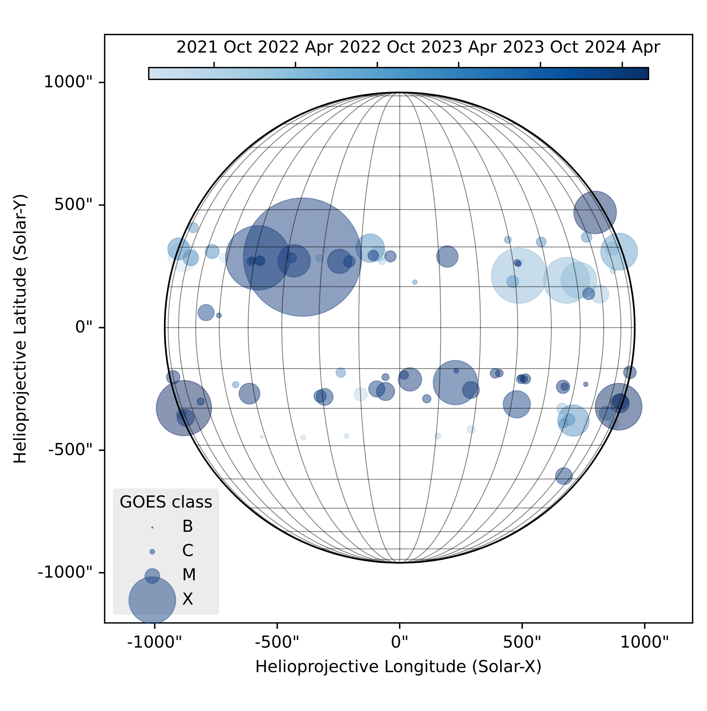
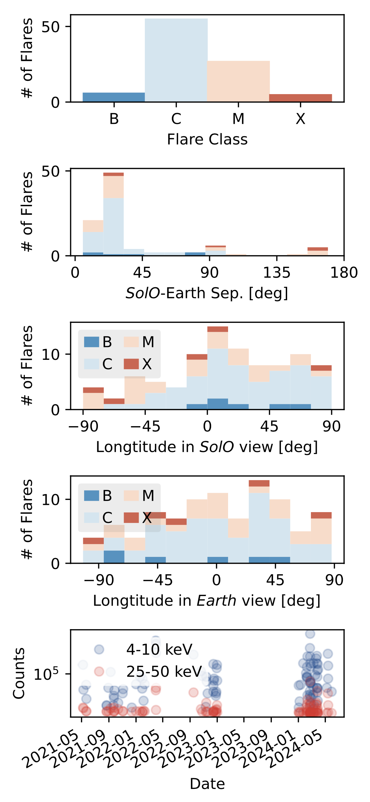

# EOVSA Flare List Science Repository

This repository contains tools for identifying and visualizing joint flare events recorded by EOVSA and Solar Orbiter/STIX. It facilitates the comparison and analysis of flare characteristics captured by both instruments.

## Repository Structure

### Main Functionality

1. **Joint Flare Event Generation**
   - **Script**: `generate_flarelist/find_common_event.py`
   - **Description**: This script cross-references flare events from EOVSA and STIX to identify common occurrences. It utilizes the STIX flare list available at [stix_flarelist_science](https://github.com/hayesla/stix_flarelist_science) and the EOVSA flare list from the [EOVSA Wiki Page](https://www.ovsa.njit.edu/wiki/index.php/Expanded_Owens_Valley_Solar_Array#EOVSA_Flare_List). The identified joint events are saved to `generate_flarelist/EOVSA_STIX_joint_flarelist.csv`.

2. **Flare Location and Statistics Visualization**
   - **Script**: `fig-eovsa_stix_flare_loc.py`
   - **Description**: This script takes `EOVSA_STIX_joint_flarelist.csv` as input and generates plots illustrating the locations and magnitudes of the joint flare events on a heliographic map. It also produces a statistical plot displaying histograms of flare class, locations, and X-ray counts.
   - **Interactive Feature**: The script supports interactive selection of flare events on the plot, allowing users to click on events and return a subset of the flares in the terminal. Because of this interactive feature, running `python fig-eovsa_stix_flare_loc.py` as a standalone script may not fully utilize the interactive functionality.

### Output Files

- **Flare Locations Plot**  



  [PDF](./fig-eovsa_stix_flare_loc.pdf)

- **Flare Statistics**  


  [PDF](./fig-flare_statistics.pdf)

## Usage

### Generating the Joint Flare List
1. Ensure you have Python installed along with necessary libraries such as Matplotlib, Pandas, and NumPy.
2. Clone this repository to your local machine.
3. Run the following command to generate the joint flare list:
   ```bash
   python generate_flarelist/find_common_event.py
   ```
4. The joint list of flare events will be saved as `generate_flarelist/EOVSA_STIX_joint_flarelist.csv`.

### Visualizing Flare Locations and Statistics

Since `fig-eovsa_stix_flare_loc.py` has interactive capabilities, it is recommended to run it in an interactive Python environment (e.g., Jupyter Notebook or IPython) to fully take advantage of the selection features.

1. Open IPython in your terminal:
   ```bash
   ipython
   ```
2. Copy the code from `fig-eovsa_stix_flare_loc.py`, and in IPython, use the `%paste` magic command:
   ```python
   %matplotlib
   %paste
   ```
   This will execute the script and allow you to interact with the flare locations on the plot.

The output plots will be saved in the repository directory as PDF files, and you can interact with the flare locations directly on the plot.

## Contributing

Contributions to this project are welcome. You can contribute by improving the scripts, adding functionalities, or fixing bugs. Please create a pull request with a clear description of your changes.

## License

This project is available under the MIT License. See the LICENSE file for more details.